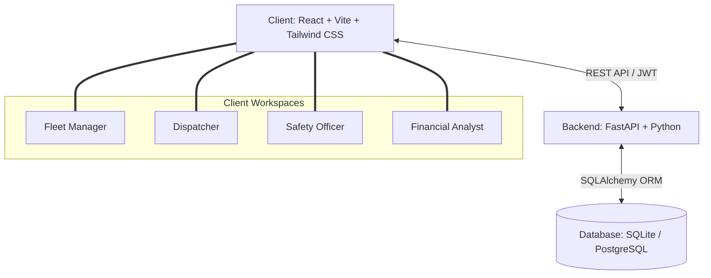

<div align="center">

# 🚛 TransitOps

### Smart Transport Operations Platform

*A centralized, role-based system for digitizing fleet, driver, trip, and maintenance management.*


</div>


## Overview

Many transport and logistics organizations still run their operations on spreadsheets, manual logs, and disconnected tools. This leads to:

- ⚠️ Scheduling conflicts and double-booked vehicles
- ⚠️ Underutilized fleet capacity
- ⚠️ Delayed or missed vehicle maintenance
- ⚠️ Inaccurate fuel and expense tracking
- ⚠️ Drivers dispatched with expired licenses
- ⚠️ No real-time visibility into operations

**TransitOps** solves this by providing a single, centralized platform that manages the **complete transport lifecycle** - from vehicle registration and driver onboarding, to trip dispatching, maintenance scheduling, expense tracking, and business analytics - all enforced by automated backend business rules.


## Key Features

| Module | Description |
|---|---|
| 🚚 **Vehicle Management** | Register, update, and track vehicles along with their live availability status |
| 🧑‍✈️ **Driver Management** | Maintain driver profiles, license validity, and real-time assignment status |
| 📦 **Trip Dispatching** | Assign drivers and vehicles to trips with automated eligibility checks |
| 🔧 **Maintenance Tracking** | Schedule servicing; vehicles are auto-removed from the dispatch pool during maintenance |
| ⛽ **Fuel & Expense Management** | Log and monitor fuel usage and operational costs per vehicle/trip |
| 📊 **Business Analytics Dashboard** | Visualize fleet utilization, fuel efficiency, operational costs, and vehicle ROI |
| 🔐 **Role-Based Access Control** | Each stakeholder sees only the features relevant to their role |


## Stakeholder Roles

TransitOps is built around **role-based access**, ensuring every user interacts only with what matters to them:

* **Fleet Manager** - Oversees fleet assets, maintenance, vehicle lifecycle, and operational efficiency.
* **Dispatcher** - Creates trips, assigns vehicles and drivers, and monitors active deliveries.
* **Safety Officer** - Ensures driver compliance, tracks license validity, and monitors safety scores.
* **Financial Analyst** - Reviews operational expenses, fuel consumption, maintenance costs, and profitability.


## ⚙️ Core Business Rules & Automation

TransitOps enforces critical operational logic automatically at the backend, removing the need for manual checks:

- **Cargo weight validation** - Cargo Weight must not exceed the vehicle's maximum load capacity.
- **License compliance check** - Drivers with expired licenses or Suspended status cannot be assigned to trips.
- **Double booking prevention** - A driver or vehicle already marked On Trip cannot be assigned to another trip.
- **Auto status synchronization** - Dispatching a trip automatically changes both the vehicle and driver status to On Trip.
- **Auto availability restoration** - Completing a trip automatically changes both the vehicle and driver status back to Available. Cancelling a dispatched trip restores the vehicle and driver to Available.
- **Maintenance lockout** - Creating an active maintenance record automatically changes vehicle status to In Shop (hiding it from the dispatch pool). Closing maintenance restores the vehicle to Available (unless retired).

> These rules ensure the operational state of the fleet is always accurate and consistent - no manual updates required.


## 🏗️ Architecture




## 🛠️ Tech Stack

| Layer | Technology |
|---|---|
| **Frontend** | React, Vite, Tailwind CSS, TanStack React Query, Wouter, React Hook Form |
| **Backend** | FastAPI, Python, UV package manager |
| **Database** | PostgreSQL (Production) / SQLite (Local), SQLAlchemy ORM |
| **Authentication** | JWT Token-based Role-Based Access Control (RBAC) |
| **Test Suite** | Pytest |


## 🚀 Getting Started

### Prerequisites
- Node.js (v18+)
- Python (v3.10+)
- `uv` package manager (`curl -LsSf https://astral.sh/uv/install.sh | sh`)

### Installation & Run Steps

<details>
<summary><b>1. Backend Setup (FastAPI)</b></summary>

```bash
# Navigate to backend
cd server

# Install dependencies and sync environment
uv sync

# Seed local database (creates mock users, vehicles, drivers, and settings)
uv run python -m app.seed

# Run local development server
uv run fastapi dev app/main.py --host 0.0.0.0 --port 8000
```
API Documentation will be hosted at: `http://localhost:8000/docs`
</details>

<details>
<summary><b>2. Frontend Setup (React + Vite)</b></summary>

```bash
# Navigate to client
cd client

# Install packages
npm install

# Start Vite hot-reload development console
npm run dev
```
Local console will be hosted at: `http://localhost:5173/`
</details>

<details>
<summary><b>3. Running Backend Tests</b></summary>

```bash
# Navigate to backend
cd server

# Run Pytest
uv run pytest
```
</details>


## 👥 Contributors

<div align="center">

| Creator | Contributions | Profile |
| :---: | :---: | :---: |
|  <br> **k0msenapati** | Backend + Frontend | [GitHub](https://github.com/k0msenapati) |
|  <br> **Ayushb690** | Frontend | [GitHub](https://github.com/Ayushb690) |

</div>


<div align="center">

**TransitOps** - Modernizing fleet management, one trip at a time. 🚛

</div>
